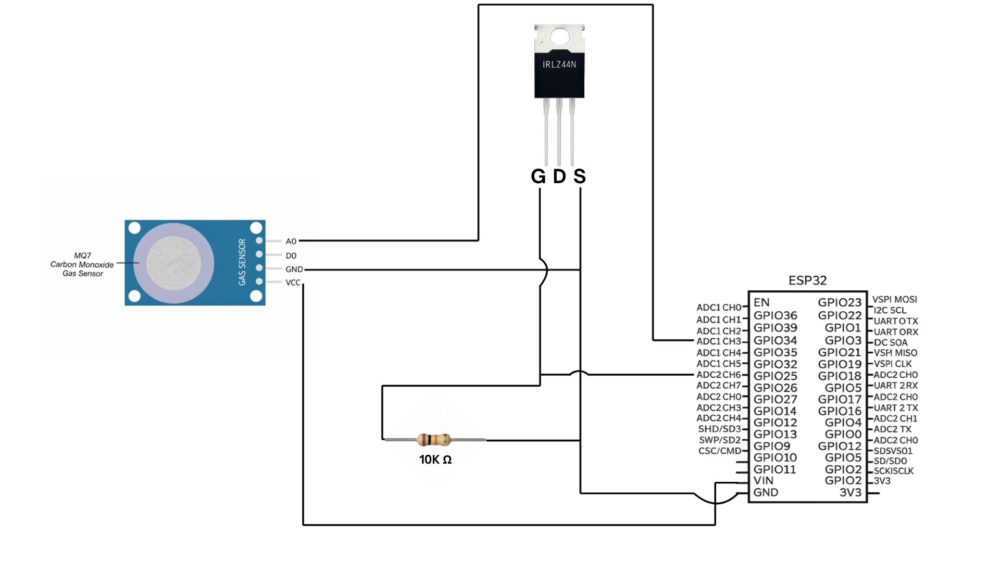
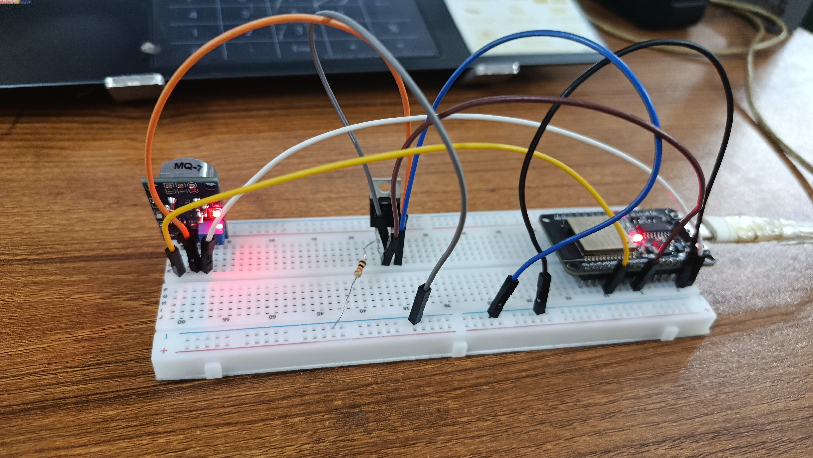

# CO Monitoring System Using ESP32 and MQ-7 Sensor

A hardware-based **Carbon Monoxide (CO) monitoring system** developed as a **group project** for the **CSE 122 – Electrical Circuits** course (Fall 2025).  
The system uses an **ESP32 Dev Module** and an **MQ-7 gas sensor** to measure CO concentration continuously over a **7-day period**, applying circuit and embedded system concepts such as **PWM control, MOSFET switching, and sensor calibration**.

---

## 📘 Course Information
- **Course Code:** CSE 122  
- **Course Title:** Electrical Circuits  
- **Semester:** Fall 2025  
- **Project Type:** Group Project  
- **Contributors:** Name1, Name2  

---

## 📌 Project Overview
This project implements a real-time CO concentration monitoring system using the MQ-7 gas sensor interfaced with an ESP32 microcontroller.  
The MQ-7 sensor requires a specific **heater cycling profile** to operate accurately. To achieve this, an **N-channel logic-level MOSFET (IRLZ44N)** is driven using **ESP32 hardware PWM (LEDC)** to dynamically control the heater voltage.

The system performs:
- A **60-second high-heating phase (5V)** for sensor cleaning
- A **90-second low-heating phase (~1.4V)** for stable sensing
- Continuous CO data acquisition and logging via the Serial Monitor

This project emphasizes **electrical circuit design**, **power control**, and **embedded system integration**.

---

## 🎯 Objectives
- Design a functional CO monitoring system using discrete circuit components
- Implement MQ-7 sensor heater control using PWM and MOSFET switching
- Apply electrical circuit concepts such as voltage control and load regulation
- Collect and analyze CO concentration data over an extended duration
- Practice embedded systems programming with real sensor data

---

## 🔩 Hardware Components
- **ESP32 Dev Module** – Main microcontroller and data processing unit  
- **MQ-7 Gas Sensor** – Carbon monoxide detection  
- **IRLZ44N N-Channel Logic MOSFET** – PWM-based heater voltage control  
- **Resistors** – Load resistance and signal conditioning  
- **USB Power Supply** – Power source for the system  

---

## 🔌 Circuit Design Overview
The MQ-7 sensor heater requires alternating heating voltages to function correctly.  
In this design:

- The **ESP32 generates PWM signals** using its hardware LEDC module
- The **IRLZ44N MOSFET** acts as a low-side switch to control heater power
- Duty cycle modulation is used to achieve an **effective heater voltage of ~1.4V**
- The sensor’s analog output is connected to an ESP32 ADC pin with proper attenuation

This approach allows precise control of heater behavior while maintaining circuit simplicity.

---

## 🧩 Circuit Diagram


---

## 🛠️ Hardware Implementation (Breadboard Setup)
[](PracticalCircuit2.jpg)

---

## ⚙️ Working Principle
1. The MQ-7 heater is powered at **5V for 60 seconds** to remove adsorbed gases  
2. Heater voltage is reduced to **~1.4V for 90 seconds** using PWM control  
3. The sensor output voltage is read via ESP32 ADC  
4. Sensor resistance (Rs) is calculated and converted to CO concentration (PPM)  
5. Data is continuously logged to the **Serial Monitor**  

This cycle repeats continuously during operation.

---

## 🔥 Heater Control & PWM Logic
- **MOSFET Type:** IRLZ44N (N-channel, logic-level)
- **PWM Source:** ESP32 hardware PWM (LEDC)
- **PWM Frequency:** 1 kHz
- **PWM Resolution:** 8-bit
- **Duty Cycle:**
  - 100% (5V) for high-heat phase
  - 28% (~1.4V average) for low-heat phase

PWM is used strictly for **voltage control**, not signal modulation.

---

## 🧪 Sensor Preheating & Calibration
The MQ-7 sensor requires a defined preheating cycle:
- **60 seconds at 5V** (high-heat phase)
- **90 seconds at ~1.4V** (low-heat phase)

Calibration is performed by determining the sensor resistance (**R₀**) in clean air.  
This calibrated value is then used to estimate CO concentration based on the sensor’s characteristic curve.

---

## 📊 Data Collection Method
- **Sampling Interval:** Every 10 seconds
- **ADC Samples:** Averaged over multiple readings
- **Data Output:** Serial Monitor
- **Monitoring Duration:** 7 days continuous operation

---

## ⚠️ Calibration Limitations & Accuracy Considerations

Although the system implements the recommended MQ-7 heater cycling profile and basic calibration using a reference resistance (**R₀**) in clean air, the collected CO concentration data should be considered **indicative rather than laboratory-grade**.

Due to time and equipment constraints, a full multi-point calibration using certified CO gas concentrations was not performed. As a result:
- Absolute CO concentration values may deviate from true environmental levels
- Sensor drift and environmental factors (temperature, humidity) may affect accuracy
- The system is more suitable for **trend observation and relative comparison** than precise measurement

Improving calibration accuracy would require controlled gas exposure, long-term stabilization, and cross-validation with a reference-grade CO sensor. These enhancements were beyond the scope of this course project but are identified as important future improvements.

---

## 💻 Software & Firmware
- **Development Platform:** Arduino IDE  
- **Programming Language:** C++  
- **Microcontroller Framework:** Arduino core for ESP32  
- **Libraries Used:**  
  - Standard Arduino libraries  
  - `<math.h>` for logarithmic and power calculations  

The firmware handles heater timing, PWM control, ADC sampling, calibration logic, and data logging.

---

## 📁 Repository Structure
```
CSE122-ElectRICAL-CIRCUIT-PROJECT/
│
├── first_ESP32_project/
│ └── first_ESP32_project.ino
│
├── ProjectReport.pdf
│
└── README.md
│
└── ImplementedCircuitDiagram.png
│
└── PracticalCircuit1.jpg
│
└── PracticalCircuit2.jpg
```

---

## 📄 Project Report
A detailed formal project report was prepared as a mandatory requirement for **CSE 122**.  
The report includes:
- Theoretical background
- Circuit analysis
- Experimental setup
- Data analysis and discussion

📎 **[View Project Report](ProjectReport.pdf)**

---

## 📎 Notes
- This repository focuses on **system-level understanding and implementation**
- Detailed derivations and experimental analysis are intentionally kept in the project report
- The project reflects both **academic learning outcomes** and **practical embedded systems experience**

---

## ✅ Status
✔ Completed  
✔ Tested  
✔ Documented  

---


